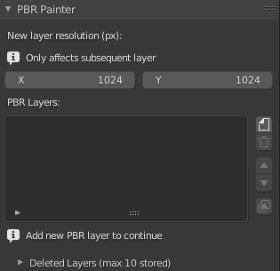
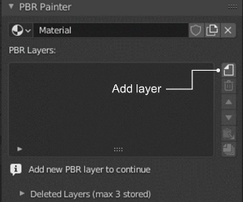
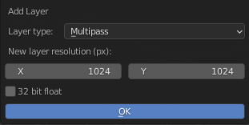
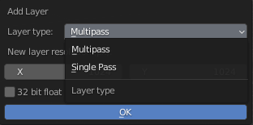
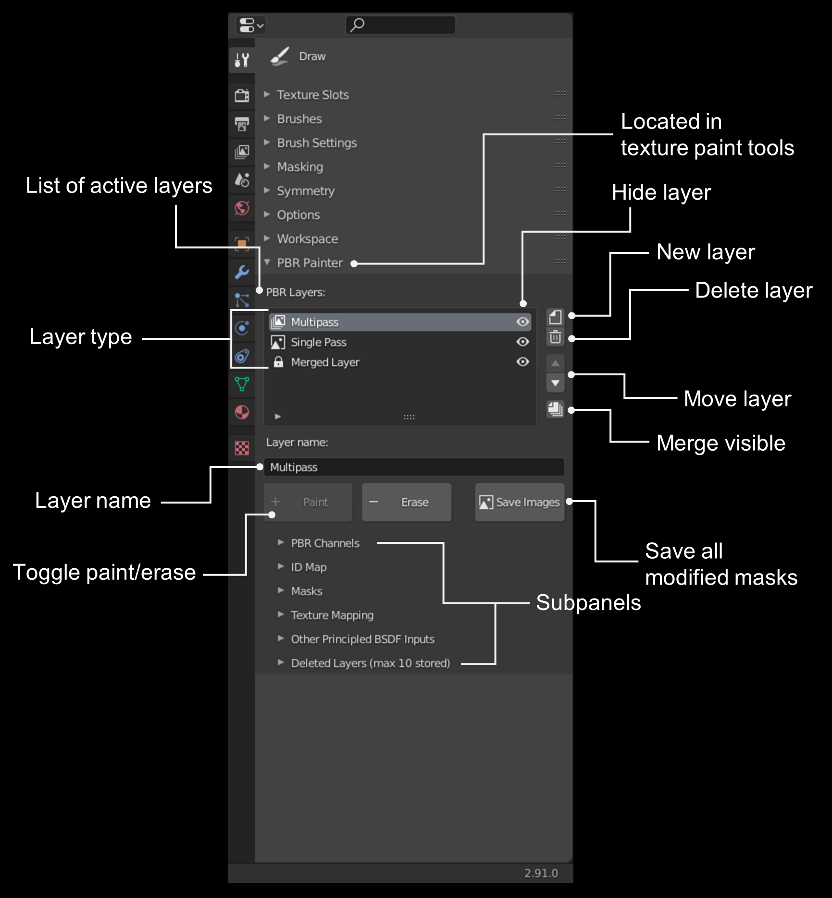

# Understanding the Main UI Panel
## The UI without Layers

When there are no currently active PBR Layers on the material, the UI will look like this and you will be prompted to add a new layer to get started:

Go ahead and click the "Add Layer" button to add a new layer:

Adding a new layer generates the following dialog box:

 

Here, you can select the layer type, either __multipass__ or __single pass__:

Briefly, __multipass__ layers are used to paint any combination of PBR texture channels _simultaneously_, whereas for __single pass__ you can paint each 
channel separately, which may be necessary in some situations (more on this below).

If you select __multipass__ (which you will use most frequently), you need to select the _resolution_ and of the new layer. 
This is the resolution of the mask you will be painting that will be used to perform the multipass PBR painting. You can also opt 
for 32 bit floating point depth, as opposed to 16 bit by default.

If you select __single pass__, nothing else needs to be specified, as you will specify these values separately for each PBR channel that you paint.

The following sections explain how the __multipass__ and __single pass__ layer types work, and how they differ from eachother. This will also become clearer
as you read through the remaining documentation.

### Multipass Layers

As mentioned, __multipass__ layers provide almost all of the functionality of PBR Painter. With a __multipass__ layer, you can paint any combination of PBR Channels - either 
using single values or imported texture maps - simultaneously onto your mesh, with a single brush stroke. 

For __multipass__ layers, you will be painting a _single_ mask that will be used to generate all of the PBR channels you have selected. This process is what enables
the multipass painting functionality. For example, you could simultaenously paint an __albedo__ texture, a __roughness__ texture and a __normal__ texture, while setting
a uniform __height__ value of, for example, 0.5. You can also opt to specify any other input to the Principled Shader to be included within the multipass setup.
Again, this will become clearer later.

### Single Pass Layers

For a __single pass__ layer, you can paint any combination of __albedo__, __metallic__, __roughness__, __normal__ or __height__ textures directly. The important distinction 
here is that the __single pass__ layer lets you paint these PBR channels separately within a single layer, meaning that they can occupy different areas on the mesh, and they
can be non-uniform values (e.g. you can paint variations in roughness directly, whereas for __multipass__ layers the roughness is either a single value or a texture). These layers
are therefore essentially the same as the internal texture paint system in Blender, although they have been adapted to be able to be included in PBR Painter's layered setup. One
important application of __single pass__ layers is painting over texture seams, which is demonstrated in the instructional video provided.

## The UI with Layers

Once you've added one or more layers, you will see the complete UI for the addon. This is outlined below:

The following can be accessed in this main panel:

- __List of active layers__: Shows all of the active PBR layers associated with the material, in order. That is, layers higher up on the list appear on top in the
material.
- __Layer type__: The type of layer, either __multipass__, __single pass__ or __merged__ (more on this later).
- __Layer name__: The (modifiable) name of the currently selected layer, shown in the list.
- __Toggle paint/erase__: Switch between painting and erasing the currently selected layer.
- __Hide layer__: Hide the currently selected layer.
- __New layer__: Add a new layer to the list. Note that the new layer will be added immediately above the currently selected layer.
- __Delete layer__: Delete the currently selected layer. Note that up to 10 layers are stored in the __Deleted Layers__ panel (more on this later).
- __Move layer__: Move the currently selected layer up or down in the list.
- __Merge visible__: Merge all visible layers (more on this later).
- __Save images__: Saves all modified masks to the .blend file. This is important to avoid any loss of work due to unexpected crashes etc.

In addition to these tools, there are also 6 subpanels which constitute the remainder of the addon: __PBR Channels__, __ID Map__, __Masks__, 
__Other Principled BSDF Inputs__ and __Deleted Layers__. The following sections in this documentation describe what is in these subpanels and 
their various functionalities/purposes. __The following sections will therefore be most useful as a reference while you are using the addon.__