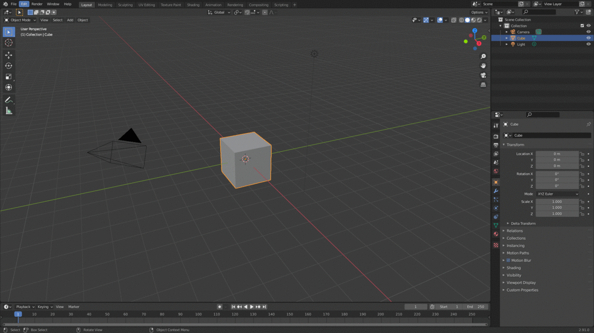
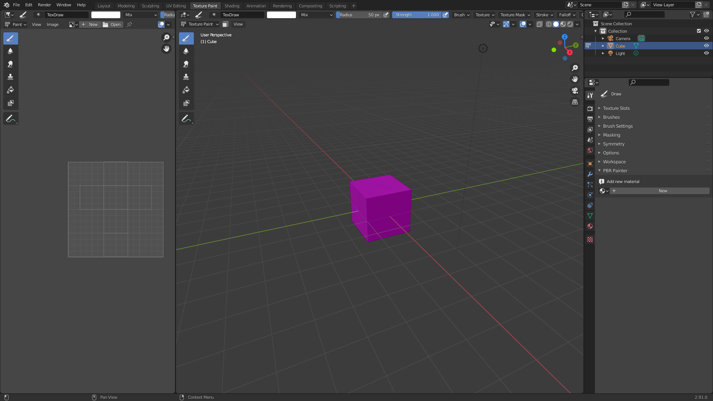

# Getting Started

## Installation

When you purchase PBR Painter, you will have access to the .zip file that contains the entire addon package. 

This can be installed in Blender using the normal approach:

## Updating to New Versions

If you already have an old version of PBR Painter installed, and wish to update to a new version, please follow the following steps:
<li> 1. Completely uninstall the old version from Blender. </li>
<li> 2. Close and restart Blender to ensure any cached files are cleared. </li>
<li> 3. Install the new version as per normal. </li>

## Finding PBR Painter in Blender

PBR Painter is located in Texture Paint mode at the bottom of the Tools panel:

## Preparing for Painting

PBR Painter combines Blender's built in texture painting toolset with complex node setups (behind the scenes) to 
enable layered, multipass PBR painting. As such, preparing a mesh for PBR Painting is identical to the steps involved
in preparing for traditional texture painting. 

In other words, the mesh must first be UV unwrapped using whichever method you prefer. Then, a new material needs 
to be added, which can be done within PBR Painter's UI. Once this is done, you are ready to start adding PBR Layers
and painting your PBR texture!

## Important Considerations (PLEASE READ)

There are a few things to consider before getting started as these will have a considerable impact on your experience with PBR Painter:

- PBR Painter generates complex node groups associated with each layer. These are created, modified, connected and deleted using the various
tools within the addon, so you never actually need to even look at the node tree. __It is important to NOT delete any of the node groups created
by PBR Painter as this could cause issues with the addon. Deleting nodes _within_ a node group may break the addon entirely.__

- As is discussed in the following sections, there is a button within the PBR Painter UI called __Save Images__, which automatically saves all modified
images. It is important that images are _regularly saved_, to avoid losing any work due to unexpected crashes etc. Alternatively, with the release of v1.1 you can
now opt to automatically save all modified images periodically by checking the __Autosave Textures__ box.

- There is a limit on the number of image texture nodes that can be represented using __Eevee__ (and also for __Cycles__, but it is much higher). If you reach this limit 
by adding many PBR layers, your material will turn solid pink. If this happens, there are two potential options going forward: Option one
is to hide one or more lower layers while you work on new layers. Option two is to take advantage of the __Merge Visible__ tool (discussed
more in the following sections), which will merge all of the currently visible active layers into a single layer.

- With v1.1, you now have access to __procedural textures__ for each PBR Channel. These provide exciting new possibilities for creating new materials from scratch, but
be aware that adding lots and lots of these to the same material, and/or adding many layers, can cause some lag. Unfortunately, this is unavoidable and is just related 
to how Blender deals with these procedural texture nodes. If you add so many layers that the lag becomes unbearable (you shouldn't get to this point in most situations),
you can use the __Merge Visible__ button to combine all of the complex layers to a single merged layer, then you can continue working from there.

- As a final note: You are encouraged to try out v2.0, which is currently in the __beta__ stage of development. This version has loads of awesome new features and has 
been completely overhauled for a __huge__ boost to performance, but given it is still in the __beta__ stage, it may contain some bugs. If you experience any bugs, please 
report these directly via email at w2gardner@gmail.com, or reach out via Twitter (@PBRPainter). 