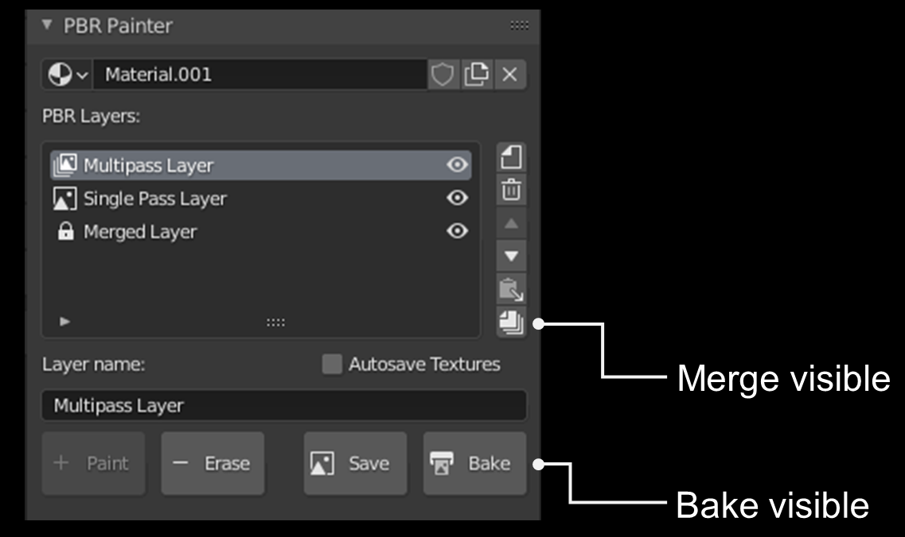
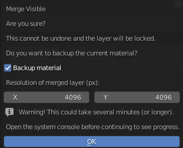

# Merge/Bake Visible

The __merge visible__ and __bake visible__ tools, located in the main UI panel, automatically bake the visible material to a set of textures.

Both use the same algorithm, which automatically detects which PBR channels (albedo, roughness, normals etc) need to be baked in order to
reproduce the material exactly. In other words, the algorithm will detect which channels vary between layers, and therefore require a baked texture.
All other channels will simply be given the constant value associated with the material.

The difference between __merge visible__ and __bake visible__ is that __merge visible__ creates a merged layer using all of the _visible_ (i.e. not hidden) layers in the PBR layers list,
in addition to baking the textures. Once layers are merged, the merged layer will replace all of the visible layers and will be locked at the bottom of the layer list. It is therefore advised 
that you only use this tool when you are entirely happy with the layers being merged and you won't need to make any changes later on.

When you select __merge visible__, you will see the following popup:

Because the merged layer cannot be modified, it is advised that you select __Backup Material__ (on by default) when merging, as this will backup the current material in
case you need to change anything later. Note that this backed up material will dissapear when restarting Blender, however up to 5 of the individual layers will also be stored in the 
__Deleted Layers__ panel, if you need to access them that way.

As per the image above, you can specify the resolution of the baked textures. This is 4k by default, but you may need to increase this if you have high resolution starting
textures and/or you use a high scale value in the mapping. If the resolution is too low, you may lose detail/quality in the merged layer, so you can repeat the process with
a higher resolution (assuming you have backed up the material).

If you are using the __displacement__ channel in any of your layers, you will also be asked whether you want to _bake displacement to normals_. This is off by default, but when
switched on, converts any displacement to a normal map, and combines this with whatever other normals are present.

As a final note, you will be prompted to open the __system console__ prior to clicking __ok__. This will let you monitor the progress of the layer merging/baking. Otherwise,
Blender will merely freeze until the algorithm is completed.