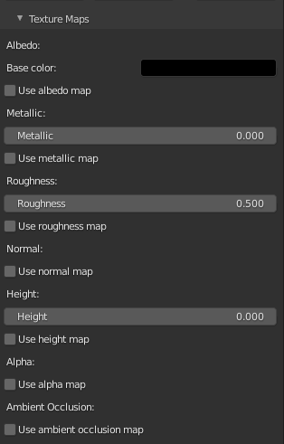
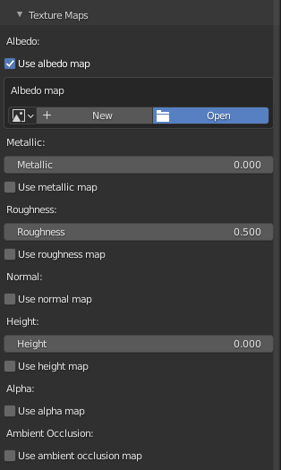
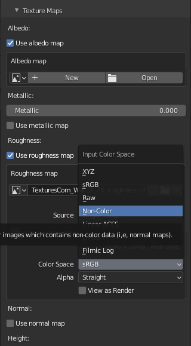
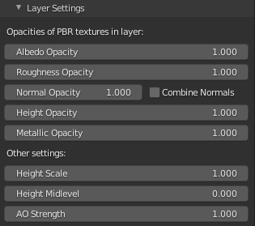
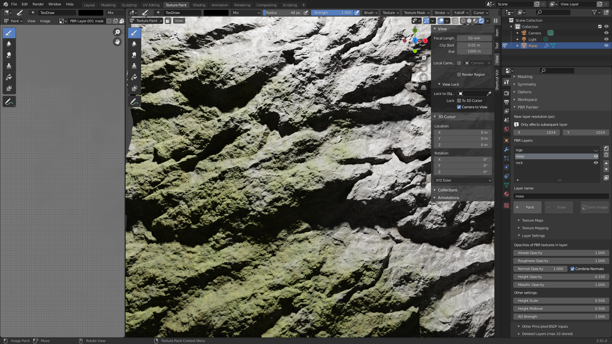
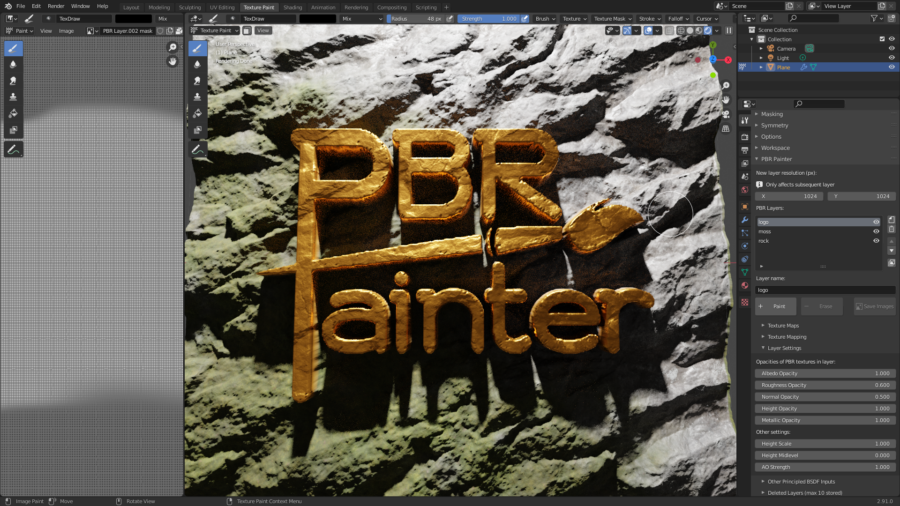

# UI Sub-Panels

## Texture Maps

Here you can import any combination of PBR texture flat maps, including __albedo/base color__, __metallic__, __roughness__, 
__normals__, __height__, __alpha__ and/or __ambient occlusion (AO)__:

Alternatively, or in combination with these maps, you can also select a single value for the __base color__, __metallic__, 
__roughness__ and/or __height__.

Ticking a checkbox will allow you to import your map from its directory:

Once a map is imported, you have access to all of the various properties associated with a normal __image texture__ node. Note
that you will need to change the __color space__ to __non-color__ if necessary (e.g. for roughness, normals etc.):

Once you are happy with your imported maps and/or values for other PBR components, this panel can be closed to clean up the UI.

Now, you are ready to check out the __Texture Mapping__ panel.

## Texture Mapping

This panel allows you to change the __scale__, __location__ (in the _x_ and _y_ directions) and the __rotation__ of any imported PBR
texture maps:

Note that if no maps are imported you will be prompted that this panel is not applicable.

Play around with these values to get the mapping that works for you, then you are ready to check out the panel you will probably use most often: the __Layer Settings__ panel.

## Layer Settings

You will probably spend most of your time within this panel while you are fine-tuning your texture. Here is where you will find the most powerful tools that will let you create ultra
realistic textures that can be tuned to look just right.

This is what the panel looks like:

Firstly, you can access the __opacities__ of each of the PBR components you specified earlier in __Texture Maps__. Note that this is the opacity of _this layer_ with respect to the 
other layers beneath it. Therefore, these sliders are _extremely_ powerful for letting you merge each component individually with those of the underlying layers.

You will also notice a __Combine Normals__ checkbox. As the name suggests, this lets you combine the normals of the current layer with those underneath, using a mathematically-derived
approach that is much more accurate and produces far better results than merely setting the normal opacity to 0.5. Because of this, you can stack normals from multiple layers and 
combine them all into a single normal map for your texture, which will retain all of the details associated with each layer's normal map in the final map.

Finally, you can also set the __Height Scale__, __Height Midlevel__ and the __AO Strength__ here, which are only applicable if you use a non-zero height (or a height map) or an 
AO map for the layer, respectively.

As an example, the following settings were used (in the moss layer) to generate this moss-covered rock texture:

And the following settings were used in the __logo__ layer to add a 3D logo (using an alpha mask) on top:

As you can see, the __Layer Settings__ panel enables essentially limitless possibilities for combining layers and generating interesting and realistic effects, so I encourage
you to play around with all of the tools provided to see what works for your texture.

## Other Principled BSDF Inputs

Here you will find all of the other inputs to the Principled Shader, which can be modified as necessary. Note that you can also change the opacities of each input for the layer,
as per the previous section.

In many cases, these values can remain unchanged, however there are certain materials that will require them to be modified. Note that any modified values will trigger the __Merge Visible__
button to bake that value as an individual map, as is explained later.

## Deleted Layers

Finally, the last panel, the __Deleted Layers__ lets you recover up to 10 deleted layers and return them to the active layers list. This is useful if you change your mind or accidentally
delete a layer and wish to recover it at a later point. Alternatively, layers can be permanently deleted from this panel, at which point they can no longer be recovered.