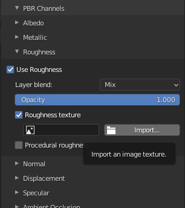
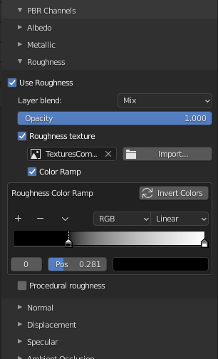
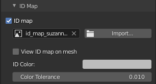
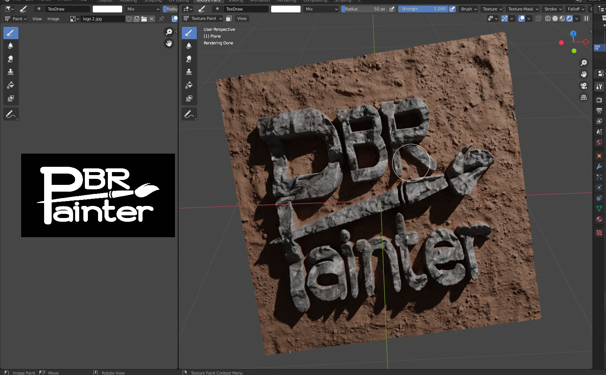

# UI Subpanels

## PBR Channels

This panel will contain different options, depending on whether the selected layer is a __multipass__ or __single pass__ layer.

#### Multipass Layer

With a __multipass__ layer selected, you will first see the following interface:

Here you can select which of these channels you want to include in the multipass setup for the layer. Any channels that are not
selected here will have an opacity of 0 for the layer. In other words, they will be given the value of whatever is underneath the
painted area on the mesh. 

The following shows all of the channels switched on, for demonstration purposes:

__Note that the _layer blend_ option for each channel is a new addition to v1.0.4. This lets you change, for each channel, how the current
layer is blended with the underlying texture.__

For the __albedo__ channel, you can either paint directly using the color of the brush or select _use constant albedo_, which will
apply a constant color over the painter area for the layer, which you can then adjust. For the __metallic__, __roughness__, __normals__, __specular__
and __height__ channels, you can select a single value that will be applied over the painted area. For the __height__ channel, you can
also adjust the height _scale_ and _midlevel_.

You can also adjust the _opacity_ of each of these layers individually. An opacity of 0 is identical to not including the channel at all, and
an opacity of 1 is completely opaque. 

If __ambient occlusion__ (AO) is selected, you will immediately be prompted to select a texture for the channel. You can also change the
AO strength here.

You can also opt to import a map/texture for each channel, using the _use channel map_ checkbox. This will then let you add a texture to
use for painting within that channel. For example, selecting _use albedo map_ shows the following:

If you use a normal map/texture, you will also see a new checkbox appear next to _opacity_, called _Combine normals_:

If selected, _combine normals_ will automatically combine the normals of the current layer with any normals underneath. The method used
is mathematically-derived, so can be applied for multiple stacked layers to combine all normals accurately. Refer to the instructional
video for a demonstration on painting with combined normals.

The following shows an example PBR Channels subpanel setup using a __multipass__ layer, whereby a set of granite rock textures have been 
imported for painting onto a Suzanne head:

And below is an example setup for painting moss on top of the granite rock layer, using __combined normals__ and a low height opacity:

#### Single Pass Layer

A __single pass__ layer lets you paint individual PBR channels one at a time, much like how Blender's internal texture painting system works. However,
the main difference is that the __single pass__ layer is embedded within PBR Painter, and therefore works within the layer-based system.

Also, by default new images will have an alpha value of 0 everywhere, so that they don't cover up
underlying layers. As you paint, only the painted areas will show on the texture.

When you select a channel, you will be prompted to first select which cannel you wish to paint:

Then, you will be prompted to create a new image (or open a previous image) in order to start painting:

Once you have an image created/loaded, you can start painting a texture for that channel. You can use all of the tools you will be familiar with to do
this, such as texture masks, stencils etc. 

When you are happy with a channel, you can switch to another and repeat these steps, until all channels have been painted.

An important application of this, which is covered in the instructional video, is painting over seams, which can be obvious if painting textures onto a mesh with
a __multipass__ layer.

Once you are happy with your imported maps and/or values for other PBR components, this panel can be closed to clean up the UI.

Now, you are ready to check out the __ID Map__ panel.

## ID Map

As the name suggests, this panel is for importing and using an __ID map__ for the material:

If you are not familiar with ID maps, they are essentially color-coded maps representing different regions in the material. 
Using an ID map lets you paint only on a specific region at a given time.

Once an ID map has been opened/imported, you will see the following options:

Click _View ID map on mesh_ to see the map on the mesh, then select the _ID Color_ of the region you wish to work with, using the
eyedropper tool:

With the color selected, you can increase the _color threshold_ value if there is an issue with the color matching, or if you want
to include similar colors in your selection.

Once the ID map is applied and the color selected, with the appropriate threshold, painting will be restricted to only that region, e.g.:

Note that once an ID map has been opened/imported for any layer, it will be applied for every other layer automatically (once ID map is
selected).

The next panel to check out is the __masks__ panel, where you can add a variety of different masks to use for the layer.

## Masks

In this subpanel, you can add a __alpha map__ and/or __procedural mask__ to the texture:

In the example below, a 'logo' alpha map has been used to paint rock over the top of a dirt background:

It is important to recognize that an alpha map can be any greyscale image, meaning that it is easy to make your own.

If you select __procedural mask__, you will have the option of either a _curvature_ mask or a _normal direction_ mask:

Note that other options will be added with future versions of PBR Painter. 

As for the ID map, you can visualize these masks on the mesh with the checkbox shown, and you can adjust them as needed using the colorramp properties and/or 
the normal direction interactive tool (for normal direction only):

Note that any masks used will be combined/multiplied (and also multiplied with the ID map, if used). This gives fine control over different combinations of masks.

## Texture Mapping

This panel allows you to change the __scale__, __location__ (in the _x_ and _y_ directions) and the __rotation__ of any imported PBR
texture maps:

Note that if no maps are imported you will be prompted that this panel is not applicable.

Play around with these values to get the mapping that works for you, then you are ready to check out the panel you will probably use most often: the __Layer Settings__ panel.

If you have an _alpha map_ loaded, you will also see the option to use separate mapping for the alpha map:

This is useful if you don't want your alpha map to be mapped in the same way as your imported textures for the material.

## Other Principled BSDF Inputs

Here you will find all of the other inputs to the Principled Shader, which can be modified as necessary. Note that you can also change the opacities of each input for the layer,
as per the previous section:

Note also that this subpanel is only available for a __multipass__ layer.

In many cases, these values can remain unchanged, however there are certain materials that will require them to be modified. Note that selecting any channel
will trigger the __Merge Visible__ function to bake that value as an individual map, as is explained later.

## Deleted Layers

Finally, the last panel, the __Deleted Layers__ lets you recover up to 10 deleted layers and return them to the active layers list. This is useful if you change your mind or accidentally
delete a layer and wish to recover it at a later point. Alternatively, layers can be permanently deleted from this panel, at which point they can no longer be recovered.